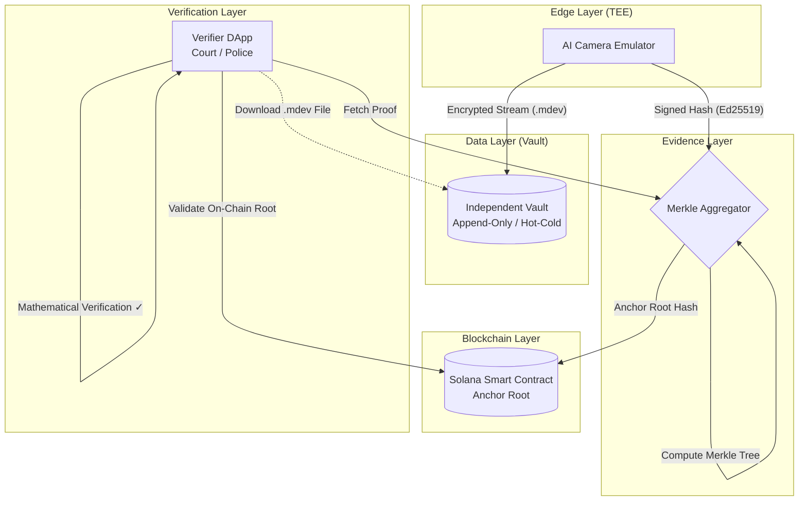

# MD-System: Trustless Digital Evidence Platform

<p align="center">
  <em>Absolute trust in digital evidence. Zero human factor. Zero administrators.</em>
</p>

## Project Overview

**MD-System (MD-Evidence System)** is a revolutionary hardware-software complex designed to eliminate the human factor and guarantee absolute, mathematically proven integrity of digital recordings. Our mission is to provide undeniable protection against falsification, tampering, and deletion of evidence.

This system is built specifically for critical enforcement and administrative sectors (TRC / Military, Police, Customs, State Officials), where the integrity of video and metadata is paramount. By removing system administrators from the chain of trust, we ensure that from the moment the camera lens captures an event to the final presentation in a courtroom, the data remains mathematically unalterable.

## Core Architecture

The system achieves trustless verification by separating the data layer from the evidence layer:

1. **Edge AI Camera Emulator**: Represents the hardware device with a Trusted Execution Environment (TEE). It captures data, adds precise metadata (NTP Time + GPS), signs it with an on-chip Ed25519 key, and outputs encrypted `.mdev` containers.
2. **Independent Vault (Data Layer)**: A strict Append-Only storage microservice. Media files are uploaded here but can *never* be deleted. A background worker automatically archives media older than 7 days from Hot to Cold storage.
3. **Merkle Aggregator (Evidence Layer)**: Receives cryptographically signed hashes from the edge devices, batches them together over a set time window, and computes a unified Merkle Root.
4. **Solana Blockchain (Anchoring Layer)**: Smart contracts (built with Anchor) securely store the Merkle Root on-chain, creating an immutable, timestamped anchor of the data's existence.

## Visual Workflow



## Security Model

*   **.mdev Format (MD-Evidence)**: Media is enclosed in a secure `.mdev` container with a cryptographic stub header. It cannot be opened or tampered with in standard video players or editors until it passes cryptographic verification in the specialized MD-Player.
*   **Hardware TEE Signature**: The raw frame hashes and metadata (GEO, Timestamp) are concatenated and signed directly on the device using Ed25519 private keys. This proves the data originated from a specific authorized physical device.
*   **Append-Only Vault**: The physical storage layer inherently lacks any `DELETE` API endpoints. Once an incident is recorded, it is mathematically impossible to erase the digital footprint without breaking the Merkle chain.

## Economic Efficiency (ROI)

*   **Batch Anchoring**: Anchoring every single camera frame to a blockchain is economically unviable. MD-System utilizes Merkle Trees to aggregate thousands of hashes into a single root, drastically minimizing Solana transaction fees while preserving individual verifiability.
*   **Storage Separation**: Only 32-byte hashes are sent to the blockchain. Heavy media files remain in off-chain Hot/Cold storage, reducing data costs to near zero.
*   **Roadmap / Architecture Note**: 
    *   *Current Model*: Individual root anchoring for distinct devices or device sets.
    *   *In R&D*: **"Shared Tree for Fleet"**. We are researching the capability to aggregate data from an entire nationwide fleet of devices into a single, synchronized Merkle Tree to push transactional costs to the absolute minimum.

## Quick Start

The entire project is structured as a cloud-ready Monorepo. You can launch the full architecture (Emulator, Aggregator, Vault, and DApp) locally with a single command.

### Prerequisites
*   [Docker](https://www.docker.com/) and Docker Compose

### Run the Stack
```bash
# Clone the repository
git clone https://github.com/CenterDigitalTrust/MD-System.git
cd MD-System

# Start the full environment
docker-compose up --build
```

The services will be available at:
*   **Verifier DApp (UI)**: `http://localhost:3001`
*   **Independent Vault API**: `http://localhost:4000`
*   **Merkle Aggregator API**: `http://localhost:3000`
