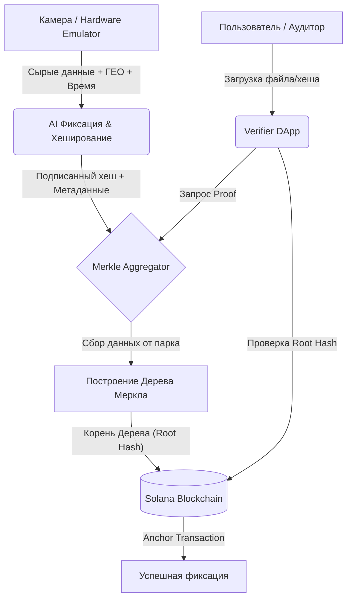

# Архитектура MD System

В данном документе описывается архитектура системы, потоки данных и логика работы AI-фиксации.

## Поток данных (Data Flow)

## AI Фиксация
- Определение динамики: Эмулятор генерирует фиктивные данные об обнаружении движения или инцидента.
- Формирование метаданных: Добавление координат (GPS) и точного времени (NTP).
- Криптография: Хеширование (SHA-256) и подпись приватным ключом устройства (Ed25519).

## API
- `POST /api/v1/submit-hash` - Эндпоинт на агрегаторе для приема подписанных хешей от эмуляторов.
- `GET /api/v1/proof/:hash` - Эндпоинт для получения Merkle Proof для конкретного хеша.
